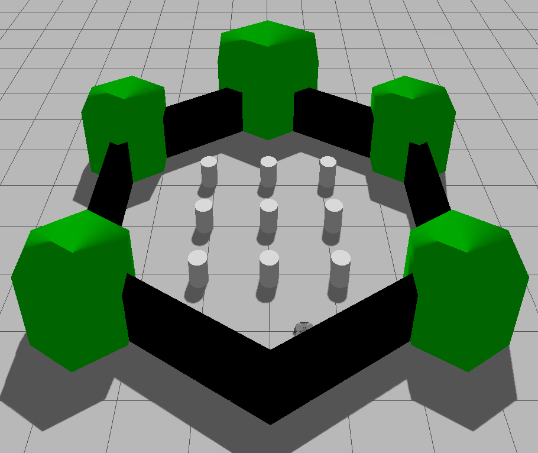

# Frontier Navigation Utilizing TurtleBot 3 with A* Based Planning and a Non-Linear Positional Controller with Look-Ahead Logic

Autonomous exploration of unknown environments with a TurtleBot 3 in simulation. The system combines an online SLAM map, frontier detection and clustering, an A* global planner, and a non-linear positional controller with look-ahead logic.

## Table of Contents

- [Aim of the Project](#aim-of-the-project)
- [Setup](#setup)
- [How to Run](#how-to-run)
- [System Overview](#system-overview)
- [Task 1: Controller](#task-1-controller)
- [Task 2: Exploration](#task-2-exploration)
  - [SLAM](#slam)
  - [Frontier Points](#frontier-points)
  - [A* Search Algorithm](#a-search-algorithm)
- [Results: Generated Maps](#results-generated-maps)
- [Discussion](#discussion)
- [Limitations and Future Work](#limitations-and-future-work)
- [Paper Idea](#paper-idea)
- [Use of AI](#use-of-ai)

---

## Aim of the Project

1. Create a controller for a robot to follow a desired trajectory.
2. Navigate an unknown environment to produce a map of the environment.
3. Combine the controller and navigation to perform exploration of the environment.

## Setup

| Item | Details |
|---|---|
| Framework | ROS 2 Jazzy on WSL2 |
| Simulator | Gazebo Harmonic |
| Visualization | Gazebo and RViz2 |
| Robot platform | TurtleBot 3 |
| Worlds | TurtleBot 3 Gazebo world, Gazebo house, empty world |

The **empty world** was used for pose-to-pose navigation and for tracking a circular trajectory. The other two worlds were used for frontier-based exploration.

| TurtleBot 3 world | Empty world | House world |
|---|---|---|
|  |  |  |

## How to Run

Open a separate terminal for each of the following commands and run them **in this order**:

```bash
# 1. Simulation
ros2 launch turtlebot3_gazebo turtlebot3_world.launch.py

# 2. Online asynchronous SLAM
ros2 launch slam_toolbox online_async_launch.py

# 3. Visualization
rviz2

# 4. Frontier detection
ros2 run controller frontier_explorer

# 5. A* planner
ros2 run controller a_star_planner

# 6. Robot controller
ros2 run controller simple_controller
```

> **Note:** The order matters. If `a_star_planner` is run before `frontier_explorer`, the frontier points do not get registered.

## System Overview


*General block diagram of the communicating parts of the overall system, with publishers and subscribers.*

| Node | Subscribes | Publishes |
|---|---|---|
| Gazebo with TurtleBot 3 | `/cmd_vel` | `/odom`, `/scan` |
| Online SLAM | `/odom`, `/scan` | `/map` |
| Frontier Generator | `/odom`, `/map` | `/detected_frontiers` |
| A* Planner | `/map`, `/odom`, `/detected_frontiers`, `/goal_reached` | `/planned_path` |
| Robot Controller | `/odom`, `/planned_path` | `/goal_reached`, `/cmd_vel` |
| RViz2 | visualizes map, frontiers and path | none |

**Overall working:**

1. The TurtleBot is simulated in a Gazebo environment.
2. The asynchronous online SLAM algorithm creates an occupancy grid map.
3. The frontier generation code uses this map to produce frontier points.
4. The A* planner uses the frontier points to generate a feasible path from the current robot pose to a frontier point. It runs the A* plan every 2 seconds and publishes the path.
5. The robot controller uses the generated path to reach the frontier point. Once the frontier point is reached, it sends a `/goal_reached` signal to obtain a new trajectory.
6. The occupancy grid, frontier points and path are visualized in RViz2.

---

## Task 1: Controller

A **non-linear positional controller with look-ahead** was chosen to provide the mobile robot with linear and angular velocities for point-to-point traversal and trajectory following.


*Block diagram of the robot controller process flow. When used with the A\* planner, a new path is obtained from `/generated_path`.*

### Controller flow

1. Subscribe to `/odom` and `/planned_path`.
2. Initialize the feedback gain terms.
3. Obtain the look-ahead point in the path.
4. Calculate `error_x`, `error_y`, `error_theta`.
5. Calculate linear and angular velocity.
6. Clip linear and angular velocity between 0 and the maximum.
7. Publish linear and angular velocity on `/cmd_vel`.
8. Continue to follow the path until the end of the trajectory.

### Control law

The final controller uses a **polar-form** error calculation:

```
e_x   = target_x - robot_x
e_y   = target_y - robot_y

distance        = euclidean_distance(e_x, e_y)
angle_to_target = arctan2(e_y, e_x)

e_theta = angle_to_target - robot_theta
e_theta = arctan2(sin(e_theta), cos(e_theta))     # wrap to (-pi, pi)

angular_velocity = ky * e_theta
linear_velocity  = kx * distance    if e_theta < 0.4 else 0
```

- Angular and linear velocities are clipped to prevent overshoot.
- The robot produces velocities for the look-ahead points obtained by querying the trajectory.
- **Look-ahead logic:** points in the trajectory whose distance is greater than the look-ahead distance are taken as target points.
- The controller and look-ahead logic run until the goal is reached, after which the robot stops publishing velocities.
- For frontier points, which have no inherent direction, the A* planner sets the yaw angle to `0.0` in the quaternion orientation. The controller was changed slightly to receive these frontier points.

**Why polar form:** The initial experiment with Cartesian errors (the difference between the robot pose and the target pose) left the robot in a stalled state where it rotated about an axis and never moved forward. Computing the distance to the target and wrapping the heading error to (-pi, pi) gave smoother traversal to the goal position.

### Pose-to-pose navigation

- A path generation script generates a fixed goal point at **(5, 3)** with an orientation of **30 degrees**. It is set by the user.
- Intermediate poses are created between the start pose and the final pose so the robot can navigate to the goal pose. Initially, only the start and end poses were used, and the robot kept going off track.
- The robot controller accepts the goal position and orientation and produces velocity commands to reach it.


*Gazebo and RViz visualization output for pose-to-pose navigation.*

### Circular path navigation

- Circle radius: **2.0**.
- Number of points on the circumference: **72** (one point every 5 degrees).
- The circumference points are converted into ROS `PoseStamped()` messages and given to the controller.


*Gazebo and RViz visualization output for circular navigation.*

---

## Task 2: Exploration

### SLAM

- Exploration uses the `slam_toolbox` online SLAM package, launched with `ros2 launch slam_toolbox online_async_launch.py`.
- It uses the 2D scans from the TurtleBot's LiDAR to produce a 2D map of the environment, using a pose graph built from the robot poses and scans.
- It processes scans **asynchronously**, independently of the sensor acquisition cycle.
- The occupancy grid is not the complete map of the environment. It only extends as far as the maximum range of the LiDAR, so the map is built up as the robot traverses the environment.
- It provides the `/map` to `/odom` coupling while creating the map.

### Frontier Points


*Block diagram of the frontier point generation process. New frontier points are updated as they become available.*

**Flow:** subscribe to `/map` and `/odom` -> receive robot pose -> convert to grid coordinates -> obtain free cells -> select frontier cells -> cluster frontier cells -> form sub-groups from clusters -> obtain centroid of the clusters -> convert to world coordinates -> collect and publish frontier cells on `/detected_frontiers`.

**Topics**

| Direction | Topic | Description |
|---|---|---|
| Subscribes | `/map` | Occupancy grid map produced by SLAM |
| Subscribes | `/odom` | Odometry of the robot |
| Publishes | `/detected_frontiers` | Detected frontier points (published as a `PoseArray`) |

**Details**

1. Frontier points are cells on the grid map at the boundary between free cells and unknown cells.
2. In practice this produces hundreds of frontier points. The finer the occupancy grid resolution, the more boundary points there are.
3. The robot does not need hundreds of frontier points, so they are **clustered** to reduce their number. Here the count dropped from about **487** to just **2, 3, 4, 7 or 8**, depending on the robot position.
4. This very small number seemed simple to work with at first, but it caused problems with exploration. When only 2 or 3 points existed, the robot moved to them and halted, because they were so close together that the LiDAR scans did not update the map enough to reveal new frontier points.
5. **Fix, sub-grouping:** clusters are split into sub-groups with a chosen maximum sub-group size (5 here; it can be other sizes, but not too small, or the number of frontier points becomes large). The centroids of the sub-groups are used as frontier points. This gives roughly **50** frontier points, changing as the robot explores.
6. **Fix, reachability:** some frontier points were surrounded by unknown cells, so a search algorithm such as A* could not reach them, making them redundant. Candidate frontier points are now checked against their **4 neighbours** before being passed on as suitable frontier points.

### A* Search Algorithm


*Block diagram of the A\* algorithm and path generation. Frontier point selection is also done in this node.*

**Topics**

| Direction | Topic | Description |
|---|---|---|
| Subscribes | `/map` | Occupancy grid map produced by SLAM |
| Subscribes | `/odom` | Odometry of the robot |
| Subscribes | `/detected_frontiers` | Detected frontier points |
| Subscribes | `/goal_reached` | Goal-reached trigger from the robot controller |
| Publishes | `/planned_path` | Planned A* path from the current robot pose to the selected frontier point |

**How it works**

1. A* forms one of the core functionalities of the exploration algorithm. It is implemented for **8 neighbours** and takes a start (current robot pose) and a goal (selected frontier point). The heuristic is Euclidean distance.
2. The frontier point with the **smallest Euclidean distance** from the current robot pose is selected as the goal.
3. If the selected point is not in a free state because of obstacle **inflation**, its neighbouring points are used. The same method is used for the start point.
4. Once selected, a frontier point is added to a list of reached frontier points so it is not used again.
5. A* returns a grid path, which is converted to world coordinates and published as a ROS `Path`.
6. The robot controller follows this path using the look-ahead method and publishes linear and angular velocities.
7. When the robot reaches its goal, it publishes on `/goal_reached` and asks the planner for a new path. The planner then picks a new frontier point and runs A* again.
8. Repeating this procedure lets the robot explore the environment.
9. The planner runs **every 2 seconds**. While doing so, the goal does not change (it only changes on the `/goal_reached` signal), but the start position follows the robot.

---

## Results: Generated Maps

**TurtleBot 3 world**


*Gazebo TurtleBot 3 world (left) and the map generated by frontier exploration (right). Arrows mark the frontier points. The green path is the trajectory.*

**Gazebo house**


*Gazebo house (left) and the map generated by frontier exploration (right). Arrows mark the frontier points. The green path is the trajectory.*

- The robot explored the TurtleBot 3 world quite well, as the map shows. Towards the end, the system started to stall because the simulation was running on the CPU, and results became erratic. The original video was about **10 minutes** long and was fast-forwarded in the submitted video due to storage constraints.
- Exploration in the Gazebo house was not as good, but given sufficient time the robot would likely have explored the environment. The original video was about **13 minutes** long.

## Discussion

1. The robot controller is a non-linear positional controller and does not drive in smooth curves the way a pure pursuit controller would.
2. Nav2's planner was first tried, configured through a YAML file, to produce A* trajectories to frontier points. It did not function even with a correct YAML configuration, so the project switched to a custom A*-based planner.
3. The core A* planner was provided by ChatGPT. The additions (frontier point selection, and accepting `/goal_reached` from the controller in the planner) were written by the author.
4. **Known issue:** the robot sometimes does not generate a path to frontier points that are visible in RViz, and instead generates an intermediate path. This is probably caused by reusing old frontier points. A better flag check could prevent it.
5. Some videos were not fully completed because the system stalled while the simulation ran on the CPU in WSL.

## Limitations and Future Work

1. The structure and geometry of the robot are not considered, which is necessary when traversing an environment.
2. Adding a **cost map** would improve the planning algorithm.
3. A planner such as one based on **pure pursuit** would let the robot move more smoothly.
4. Only a 2D map is constructed, since the focus is on exploration. In real-world scenarios, especially when exploring unknown environments that may be dangerous for humans, a **3D map** would be more suitable.
5. **Dynamic obstacle avoidance** is not incorporated. It would considerably improve navigation.
6. Only a single robot is used, so exploration takes longer. **Multiple robots** would be very beneficial.
7. On multi-robot navigation, aerial vehicles could greatly improve the ability to work with high-altitude structures such as bridges.
8. A UGV could map the ground terrain while a UAV maps structures at high altitude.

## Paper Idea

The robot was found to be very slow during exploration. A suggested paper title:

> *A Novel Controller Producing Safe and Higher Velocity Commands for Motion Planning in a Multi-Robot Exploration Setting for UGVs in a Highly Dynamic Environment*

- **Control Barrier Functions (CBFs)** would enable safety in the robot's velocity output. They also aid dynamic obstacle avoidance by placing a safety barrier around moving objects, taking their orientation, velocity and position into account.
- CBFs combined with **Model Predictive Controllers (MPC)** could provide a safe region of navigation for robots moving at higher velocities.

## Use of AI

ChatGPT and Claude were used during this project.

- **Controller:** The initial controller used positional (Cartesian) error, which caused the robot to jitter. Claude suggested the polar-coordinate approach and provided the code for it.
- **Pose-to-pose path generation:** The initial code disregarded intermediate points. Claude provided the code segments for intermediate point generation.
- **Frontier exploration:** The base code was provided by ChatGPT. The addition of multiple sub-clusters was done by the author.
- **A\* algorithm:** The core algorithm was provided by ChatGPT. The author implemented frontier selection and frontier point switching in the planning section.
- **Documentation:** The ROS Wiki was used for general information about ROS operation.
